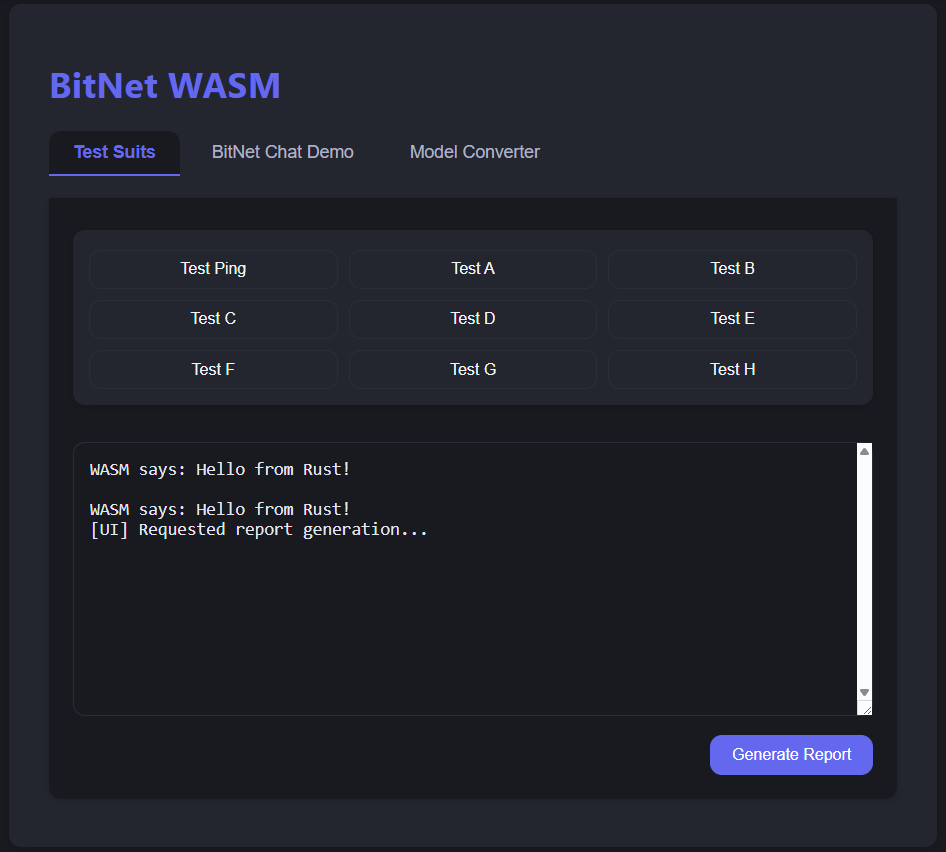

# BitNet WASM (`bitnet-wasm`)

> **🌐 Run BitNet LLMs in your browser — WASM bindings, WebGPU acceleration, and JS interop for blazing-fast, portable inference.**

---


---

## Overview

BitNet WASM brings the power of the BitNet LLM architecture to the browser and other WebAssembly environments. It provides a high-level API bridge between the high-performance Rust core (`bitnet-core`) and JavaScript, leveraging WebGPU for hardware-accelerated inference.

### Purpose

- Run BitNet inference entirely in the browser (Chrome, Firefox, Edge, Safari)
- Enable interactive, zero-latency web demos and applications
- Provide a robust foundation for future web-based GUIs and research tools

### Architecture

- The `bitnet-wasm` crate acts as a library, exposing a JS-friendly API via `wasm-bindgen`.
- It reuses the entire compute engine from `bitnet-core`.
- A small, optional binary (server) is included for easy local development and testing.

---

## Features

- 🌐 **WebAssembly (WASM) Target:** Run BitNet natively in browsers and other WASM runtimes (e.g., Deno, Wasmer)
- 🚀 **WebGPU Acceleration:** Leverage modern GPU hardware for inference directly from the browser via `wgpu`
- 🔗 **High-Level JS/TS API:** A clean, async/await-based API for easy JavaScript/TypeScript integration using `wasm-bindgen`
- 📦 **Modular Design:** Reuses all validated logic from the `bitnet-core` workspace crate
- 🚚 **Built-in Dev Server:** A simple, pure-Rust static file server to get demos running instantly with no external dependencies like Node.js or Python
- 🔄 **Streaming Generation:** Supports token-by-token streaming to the UI for a responsive, real-time user experience

---

## Table of Contents

- [Overview](#overview)
- [Features](#features)
- [Project Structure](#project-structure)
- [Quick Start](#quick-start)
- [Build Instructions](#build-instructions)
- [API Design & Usage](#api-design--usage)
- [Testing Strategy](#testing-strategy)
- [Known Issues & Limitations](#known-issues--limitations)
- [Development Checklist](#development-checklist)
- [References](#references)
- [Developer Automation & Workflow Vision](#developer-automation--workflow-vision)

---

## Project Structure

```text
bitnet-rs/
└── crates/
    └── bitnet-wasm/
        ├── static/                # Static assets for the demo web page
        │   ├── index.html
        │   ├── style.css
        │   ├── main.js
        │   └── pkg/               # WASM build output (generated by wasm-pack)
        ├── src/
        │   ├── bin/
        │   │   └── server.rs      # Source for the Rust static file server binary
        │   ├── lib.rs             # The main WASM library entry point
        │   ├── api.rs             # The core BitNetWasm struct and its public API
        │   └── tests.rs           # WASM/browser test implementations
        ├── Cargo.toml
        ├── dev.sh                 # One-command build, serve, and open script
        ├── README.md
        └── Screenshot.png
```

---

## Quick Start

> **Note:** Requires a recent Rust toolchain and [wasm-pack](https://rustwasm.github.io/wasm-pack/installer/).

```sh
# 1. Install wasm-pack (if not already installed)
cargo install wasm-pack

# 2. Navigate to the wasm crate
cd crates/bitnet-wasm

# 3. Build the WASM package for the web
# This compiles the Rust lib to WASM and places it in the `static/pkg` directory.
wasm-pack build --target web --out-dir ./static/pkg --out-name bitnet_wasm

# 4. Start the development server from the crate's root
cargo run --bin server

# 5. Open your browser to http://localhost:8080 and check the console.
```

---

## Build Instructions

1. **Install Prerequisites:**
   - [Rust](https://rustup.rs/)
   - [wasm-pack](https://rustwasm.github.io/wasm-pack/installer/)

2. **Build the WASM Library:**
   - From within the `crates/bitnet-wasm` directory, run:

     ```sh
     # Clean build for production
     wasm-pack build --target web --out-dir ./static/pkg --out-name bitnet_wasm

     # Development build with debug symbols
     wasm-pack build --dev --target web --out-dir ./static/pkg --out-name bitnet_wasm
     ```

3. **Serve the WASM and web assets:**
   - Run the dev server (default port: **8080**):

     ```sh
     
     cargo run --bin server
     # Or specify a directory: cargo run --bin server -- static/
     ```

---

## API Design & Usage

### Rust API (`src/api.rs`)

```rust
use wasm_bindgen::prelude::*;
use bitnet_core::model::Transformer;
use js_sys::Function;

#[wasm_bindgen]
pub struct BitNetWasm {
    model: Transformer,
}

#[wasm_bindgen]
impl BitNetWasm {
    /// Creates a new, empty BitNet instance.
    #[wasm_bindgen(constructor)]
    pub fn new() -> Self {
        // ... initialization logic ...
        Self { /* ... */ }
    }

    /// Loads a model and tokenizer from a URL.
    pub async fn load_model(&mut self, model_url: String) -> Result<(), JsValue> {
        // ... fetch and deserialize model ...
        Ok(())
    }

    /// Generates text token-by-token, streaming results to a JS callback.
    pub async fn generate(
        &self,
        prompt: String,
        max_tokens: usize,
        on_token_stream: &Function,
    ) -> Result<(), JsValue> {
        // ... generation loop ...
        Ok(())
    }
}
```

### JavaScript Usage (`static/main.js`)

```js
import init, { BitNetWasm } from './pkg/bitnet_wasm.js';

async function main() {
    await init();
    const bitnet = new BitNetWasm();
    await bitnet.load_model('/models/bitnet_1.58b.gguf');
    const handleNewToken = (token) => {
        document.getElementById('output-area').value += token;
    };
    const prompt = "The definition of insanity is";
    document.getElementById('output-area').value = prompt;
    await bitnet.generate(prompt, 100, handleNewToken);
}
main().catch(console.error);
```

---

## Testing Strategy

- **Manual Browser Testing (Recommended and Supported):**
  - Use `make wasm-dev` (or `./dev.sh`) to build the WASM, start the dev server, and automatically open the browser to the web UI.
  - All browser logs and test results are captured in real time and sent to the Rust server via the WebSocket log bridge. See the [Capturing Browser Logs in Rust Console](#2-capturing-browser-logs-in-rust-console) section for details.
  - Use the web UI to run tests by clicking the test buttons, view logs, and generate Markdown reports. Logs and reports are saved in the `logs/` directory.
  - To stop the dev server, use `make wasm-stop` or the appropriate stop command.

- **Rust Unit Tests:**
  - Use standard `#[test]` for all non-WASM, non-wgpu logic within the crate.

- **Writing and Extending Browser-Based Tests:**
  - To add browser-based (WASM) tests, create new async test functions in `src/tests.rs` and add them to the macro in `src/api.rs` to export them to the web UI.
  - These tests will appear as buttons in the web UI and can be run interactively in the browser. Their logs/results are sent to the Rust server and can be saved as Markdown reports.
  - For more details and advanced patterns, see the [Capturing Browser Logs in Rust Console](#2-capturing-browser-logs-in-rust-console) section.

- **GPU Error Handling in WASM Tests:**
  - WASM/browser tests use a custom, WASM-safe `GpuTestError` enum for robust GPU error handling.
  - This allows detailed error reporting for pipeline creation, shader compilation, device, and adapter errors, even in browser/CI environments.
  - See `src/tests.rs` for the implementation and usage pattern.
  - This approach is future-proof and can be extended for more advanced GPU/browser test error handling as integration deepens.

---

**Note:**

- Headless browser testing with `wasm-pack test` is not currently supported in this workflow. All browser-based tests are run interactively via the web UI.

---

## Known Issues & Limitations

- **WebGPU Support:** Requires a modern browser with WebGPU enabled. See [caniuse.com/webgpu](https://caniuse.com/webgpu) for compatibility. A graceful fallback or error message should be implemented for unsupported browsers.
- **Model Loading & Caching:** Fetching large model files on every page load is inefficient. The demo should leverage the browser's Cache API via `web-sys` to store the model locally after the first download.
- **Memory Limits:** Browsers impose memory limits on tabs, which may restrict the maximum size of models that can be loaded client-side.
- **Single-Threaded WASM:** Standard WASM runs on the browser's main thread. For a non-blocking UI, all heavy computation (like model loading and inference loops) must be async and use yield points to avoid freezing the page. Web Workers can be used for true parallelism in the future.
- **File Serving:** The dev server is for local development only. For production, use a proper static file host.

> **Tip:** If you encounter issues, check the browser console for errors and ensure WebGPU is enabled.

---

## Development Checklist

- [x] Crate setup & configuration (`bitnet-wasm` created, Cargo.toml, dependencies)
- [x] Core API implementation (BitNetWasm struct, async methods, error handling)
- [x] Development server (Rust static file server in `src/bin/server.rs`)
- [x] Web demo (`static/index.html`, `main.js`, `style.css`)
- [ ] Testing & CI (unit tests, browser tests, GitHub Actions)
- [ ] Documentation (README, code comments, API docs)

---

## References

- [wasm-bindgen Documentation](https://rustwasm.github.io/wasm-bindgen/)
- [wgpu on WASM](https://github.com/gfx-rs/wgpu)
- [MDN WebGPU API](https://developer.mozilla.org/en-US/docs/Web/API/WebGPU_API)
- [BitNet-rs Main README](../../README.md)

---

## Developer Automation & Workflow Vision

> **Goal:** Create a seamless, developer-friendly workflow for BitNet WASM development, browser integration, and future automation. This section documents our vision and step-by-step plan for automation, log capture, and editor/AI integration.

### 1. One-Command Build, Serve, and Open

**Goal:**
Make it so you can build the WASM, start the server, and open the browser with a single command.

**Options:**

- **Shell Script (cross-platform):**

  - Write a script (e.g., `dev.sh` for Unix, `dev.ps1` for Windows) that:
    - Runs `wasm-pack build ...`
    - Runs `cargo run --bin server` (possibly in the background)
    - Opens the browser to `http://localhost:8080` (using `xdg-open`, `open`, or `start`)
- **Rust-based Launcher:**
  - Write a small Rust CLI tool (e.g., `dev.rs`) that does the above steps using `std::process::Command`.
- **Cargo Make or Justfile:**
  - Use [cargo-make](https://sagiegurari.github.io/cargo-make/) or [just](https://just.systems/) for a cross-platform task runner.

**Recommendation:**
Start with a shell script for simplicity, then consider a Rust launcher for full cross-platform support.

---

### 2. Capturing Browser Logs in Rust Console

BitNet WASM: Browser Log Bridge & Unified Test Reporting

=======================================================

Vision:

- Everything printed/logged in the browser (JS or WASM) is sent to the Rust server in real time via WebSocket.
- The Rust server receives these logs, prints them to the console, and writes them to a Markdown `.md` file using the `TestReporter` utility from `bitnet-tools/src/test_utils.rs`.
- The web UI has test buttons (e.g., "Run Kernel Test", "Run Model Test", etc.) that trigger browser-side tests, whose logs/results are sent back to the server.
- You get the same beautiful Markdown reports for browser/WASM tests as you do for native Rust tests.

How to Achieve This:

1. WebSocket Log Bridge
   - Server: Add WebSocket support to your Rust static server (e.g., using `tokio-tungstenite` or `ws` crate).
   - Browser: In your JS, open a WebSocket connection to the server and override `console.log`, `console.error`, etc. to send logs over the socket.

2. TestReporter Integration
   - On the Rust side, for each test run (triggered from the browser), create a new `TestReporter` instance.
   - As log messages come in over the WebSocket, feed them into `TestReporter` (as if they were Rust-side logs).
   - When a test completes (browser sends a "done" message), call `generate_report()` to write the Markdown file.

3. Web UI Test Buttons
   - Each button triggers a specific test in JS (mirroring your Rust-side tests).
   - Each test sends logs/results over the WebSocket as it runs.

Example Flow:

1. User clicks "Run Kernel Test" in browser.
2. JS sends `{type: "start", test: "kernel"}` over WebSocket.
3. JS runs the test, sending logs/errors as `{type: "log", level: "info", message: "..."}`.
4. On completion, JS sends `{type: "done", test: "kernel"}`.
5. Rust server collects logs, prints to console, and writes a Markdown report.

Step-by-Step Implementation Plan:

A. Add WebSocket Support to Your Rust Server

- Replace or augment your current `tiny_http` server with a WebSocket-capable server (e.g., `tokio-tungstenite`).
- Accept WebSocket connections at `/ws` or similar.
- For each connection, receive log messages and print/store them.

B. JS: Log Bridge

- In `main.js`, open a WebSocket to `ws://localhost:8080/ws`.
- Override `console.log`, `console.error`, etc. to send messages over the socket.
- When a test is run, send a "start" message, then logs, then a "done" message.

C. Rust: Integrate with TestReporter

- For each test session, create a `TestReporter`.
- As logs come in, call `log_message_simple`.
- On "done", call `generate_report()` to write the `.md` file.

D. Web UI: Test Buttons

- Add buttons for each test (e.g., "Run Kernel Test").
- Each button triggers a JS function that runs the test and logs output.

// This plan is a living spec. Update as you implement and refine the workflow!


### 4. VS Code/Cursor Integration and "MCP" (Model Context Protocol)

**Goal:**
Enable seamless back-and-forth between your code, browser, and AI assistant (Cursor), possibly automating feedback and log capture.Extending Capturing Browser Logs in Rust Console

**Ideas:**

- **Editor Integration:**

  - Use VS Code tasks or launch configs to run your dev script/server and open the browser.
  - Use the Cursor extension to monitor logs or trigger actions based on file changes or log output.
- **MCP (Model Context Protocol):**
  - Define a simple protocol (e.g., JSON over WebSocket or HTTP) for the browser to send logs, events, or even model outputs back to the server/editor.
  - Cursor could monitor this channel and provide suggestions, error analysis, or even auto-patch code.
- **Auto-Feedback Loop:**
  - When a browser error or log is received, Cursor could automatically surface it in the editor, suggest fixes, or even open the relevant file/line.

**Recommendation:**

- Start by implementing a log bridge (see above).
- Document a simple JSON protocol for logs/events.
- As Cursor, I can monitor this log file or endpoint and use it to provide context-aware suggestions or debugging help.

---

### Step-by-Step Plan & Checklist

- [x] **Static file server:** Serve `static/` on port 8080 with Rust (`src/bin/server.rs`).
- [x] **WASM/JS integration:** Minimal WASM export (`hello()`), called from JS and displayed in the browser.
- [x] **One-command dev script:** Script or Rust tool to run `wasm-pack build`, start the server, and open the browser automatically.  
    _Now provided via `make wasm-dev` (start) and `make wasm-stop` (stop) from the project root._
- [x] **Log bridge:** JS sends logs/errors to the Rust server (via WebSocket or HTTP POST), which prints them in the console.
- [ ] **MCP protocol draft:** Document a simple JSON protocol for logs/events/feedback between browser and server/editor.
- [ ] **Editor/AI integration:** Enable Cursor or VS Code to monitor logs/events and provide context-aware suggestions or automation.
- [ ] **Live reload (optional):** Auto-reload browser on file changes for rapid iteration.

### Notes

- Start with a shell script or Rust CLI for the one-command workflow; expand to more advanced automation as needed.
- Log bridge can be simple (HTTP POST) or real-time (WebSocket).
- MCP can evolve as the project grows; document as you go.
- This section is a living plan—update as you make progress!

---

## Design Philosophy: Separation of Concerns

BitNet WASM is designed to be both a clean, portable inference library for downstream application developers **and** a powerful, developer-friendly environment for contributors and advanced users.

### How the Crate is Structured

- **WASM Core** (`bitnet-wasm`):
  - Provides model loading, inference, and (optionally) test execution APIs for the browser and other WASM runtimes.
  - Contains **no server-side logic, no WebSocket server, and no Markdown reporting**—it is pure, portable, and suitable for embedding in any web app.

- **Dev/Demo Server** (`src/bin/server.rs`):
  - A local Rust server for development and demonstration purposes.
  - Serves static files, provides a WebSocket log/test bridge, and integrates with `TestReporter` to generate Markdown reports from browser-side logs and tests.
  - **Not required** for downstream users, but invaluable for contributors and advanced debugging.

- **Downstream Application Developers:**
  - Use the WASM package and JS glue for inference and (optionally) browser-side tests.
  - Do **not** need the dev server, WebSocket bridge, or Markdown reporting unless they want to use the enhanced dev workflow.

### Summary Table

| Component         | Model Inference | Testing | WebSocket Log Bridge | Markdown Reporting | File I/O |
|-------------------|-----------------|---------|----------------------|--------------------|----------|
| WASM Core         | ✅              | ✅      | ❌                   | ❌                 | ❌       |
| Dev/Demo Server   | ❌              | ❌      | ✅                   | ✅                 | ✅       |
| Downstream Apps   | ✅              | (opt)   | (opt, if wanted)     | ❌                 | ❌       |

**Bottom Line:**

- The WASM core is pure and portable.
- The dev server adds powerful tools for contributors.
- Downstream users can use the WASM core as-is, or adopt the dev workflow if desired.

---

## New Modern Web UI & Workflow (2025)

BitNet WASM now features a modern, dark, tabbed web UI for rapid development, testing, and demoing BitNet in the browser:

- **Tabbed Interface:**
  - **Test Suits:** Run tests, view logs in a console, and generate Markdown reports with a single click.
  - **BitNet Chat Demo:** Chat-style interface for interactive model inference (WIP).
  - **Model Converter:** Upload and convert models (e.g., Llama/HF) to BitNet format (WIP).
- **Live Log Bridge:**
  - All browser logs (via `console.log`) are sent in real time to the Rust server via a persistent WebSocket connection.
  - Logs appear in both the browser console area and the Rust server terminal.
- **Markdown Reporting:**
  - Click **Generate Report** to create a beautiful Markdown test report (`logs/browser_test.md`) from your browser session.
  - Reports are generated using the same `TestReporter` utility as native Rust tests.
- **Responsive, Accessible, and Developer-Friendly:**
  - Modern dark theme, grid layout for test buttons, scrollable areas, and clear feedback for all actions.

### Example Workflow

1. Start the dev server (`make wasm-dev` or via the provided script).
2. Open the web UI (auto-opens in browser).
3. Click **Test Ping** or other test buttons to run tests and see logs in the console.
4. Click **Generate Report** to save a Markdown report of your session.
5. Check the `logs/` directory for the generated `.md` file.

### UI Screenshot

